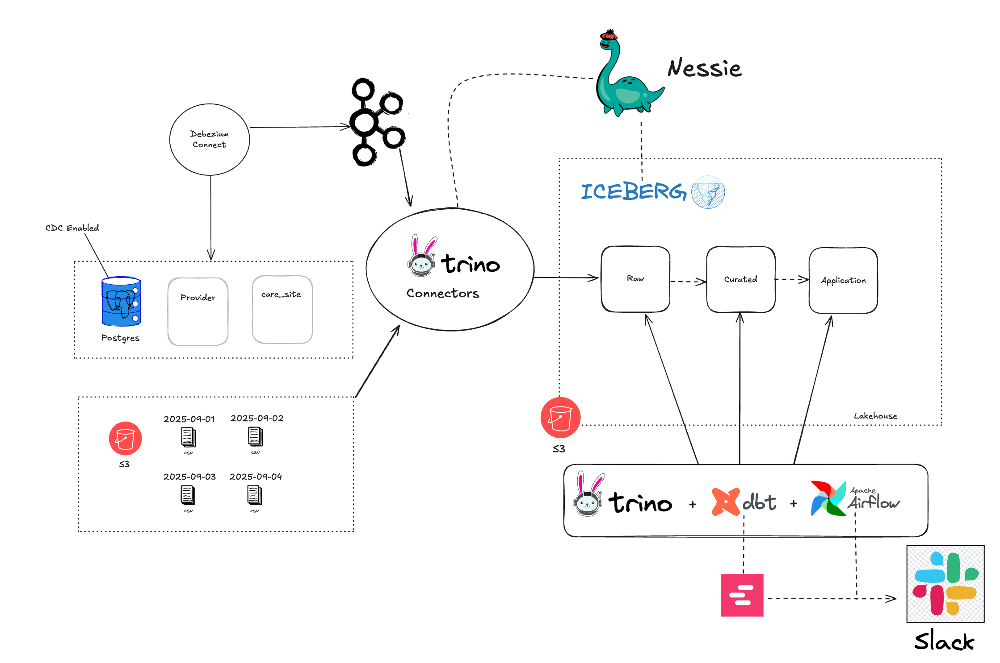
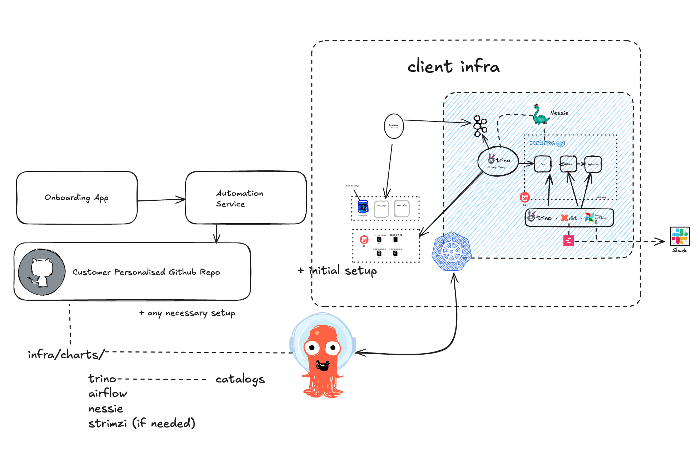

# Promptly Challenge – Data Engineer

This repository contains my solution to the Promptly Data Engineer Challenge. The goal is to design and implement a modern data pipeline that ingests data from a Postgres database, processes it through a streaming and lakehouse architecture, and makes it available for analytics and transformation using Trino and DBT.

## Local Setup

### Prerequisites

* Docker
* Docker Compose
* Python 3.12.\*
* Poetry

### Install Dependencies

```bash
poetry config virtualenvs.in-project true
poetry install
```

### Start Local Infrastructure

```bash
poetry run task dev_setup
```
This command will start all the necessary infrastructure using Docker Compose.
After that it populates the Postgres database with sample data and configures the CDC logic to make the data available in Kafka.

### Run DBT Models

```bash
poetry run task run_poc
```

### Check all components UI
* Postgres: [http://localhost:5432](http://localhost:5432)
* Kafka UI: [http://localhost:9999](http://localhost:9999)
* Trino: [http://localhost:8080](http://localhost:8080) (admin)
* MinIO: [http://localhost:9000](http://localhost:9000) (minioadmin/minioadmin)
* Nessie: [http://localhost:19120](http://localhost:19120)

The Elementary Data UI will pop up after running the dbt models for the first time.

### Tips
- If coding in VSCode you can install the sqltools extension to connect to Trino and access the data directly from the editor. The configurations are in `.vscode/settings.json`.
- Create a `.env` file based on the `.env.example` the file is already filled with the right values for local development.

### Acceptance Tests
```bash
poetry run task test_acceptance_dbt
```
The idea of this test is to guarantee that the image built with this repo can run all the dbt commands successfully if it has proper access to the infrastructure (Trino, Postgres, MinIO).

## Challenge 1 – Data Ingestion and Transformation

### High-Level Architecture

The architecture chosen to solve this challenge includes:
* **Trino** as the query engine.
* **DBT** as the transformation framework, promoting modularity and best practices for data projects.
* **Iceberg** as the lakehouse format, enabling data governance, versioning, schema evolution, and time travel.
* **Nessie** as the Iceberg catalog, supporting environment isolation (staging vs. production) and implementing techniques such as Write Audit Publish (WAP) to ensure data quality and prevent bad data from reaching end users.
* **Airflow** as the orchestrator: Airflow schedules, monitors, and manages complex data workflows.
* **Debezium CDC** to extract change data capture (CDC) events from Postgres.
* **Kafka** as the broker to receive CDC events, acting as a reliable intermediary between Debezium and Trino.
* **Elementary Data** for data quality monitoring, generating tests, metrics, and alerts to ensure data reliability.



#### Incremental Data Considerations

The `provider` and `care_site` tables in Postgres do not include timestamps, which complicates incremental extraction. Potential solutions:

1. Ask clients to add an `ingestion_time` field (not always feasible in a B2B onboarding context).
2. Work with the existing tables using either:

   * **Full reload** of the tables.
   * **CDC** for continuous incremental updates.

Full reload strategies:

* Small databases without immediate availability requirements: use `COPY` to dump tables to S3.
* Large, non-critical databases: `COPY` to S3 still works.
* Large, critical databases with minimal daily changes: provide a read replica to reduce client-side overhead.

If none of the above are feasible, enable **CDC**.
For example, if `provider` sees 2 million new records daily, CDC is more scalable, but more complex to maintain (Kafka, Debezium, etc.).

#### Data Flow

1. Postgres tables configured with `wal_level = 'logical'` and appropriate `PUBLICATION` tables.
2. **Debezium Connector** extracts events and publishes them to Kafka topics (e.g., `cdc.public.provider`).
3. **Trino** reads multiple sources using connectors:

   * [Kafka Connector](https://trino.io/docs/current/connector/kafka.html)
   * [Iceberg Connector](https://trino.io/docs/current/connector/iceberg.html)
   * [S3 Connector](https://trino.io/docs/current/connector/hive.html)
4. **DBT** executes SQL transformations through the [Trino Adapter](https://docs.getdbt.com/docs/architecture/trino).
5. **Nessie** manages Iceberg table versions and enables WAP to ensure data quality.
6. **Elementary Data** monitors data quality, generating tests, metrics, and alerts.
7. **Airflow** orchestrates the complete workflow, from Postgres CDC ingestion to Trino query execution and DBT transformations.

---

### Airflow Pipeline

```text
run_dbt_deps -> run_setup_elementary -> run_dbt_models -> run_dbt_tests -> export_elementary_report -> promote_iceberg_tables_to_prod
```

* `run_dbt_deps`: Install DBT dependencies.
* `run_setup_elementary`: Initialize Elementary Data tables for monitoring.
* `run_dbt_models`: Execute DBT models (data transformations).
* `run_dbt_tests`: Run DBT data validation tests.
* `export_elementary_report`: Export data quality reports from Elementary Data.
* `promote_iceberg_tables_to_prod`: Promote staging Iceberg tables to production using Nessie.

Each task is implemented via a **KubernetesPodOperator** running a Docker container with the project code. Commands are executed via **Taskipy**, whether DBT commands or Python scripts.

---

## Challenge 2 – Client Onboarding

### Overview


* **Onboarding App**: Streamlit interface for team members to submit new client forms.
* **Automation Service**: Submitting a form triggers creation of a new GitHub repository based on a template containing the client-specific pipeline infrastructure
* **Client Pipeline**: Adapted from Challenge 1, Trino connectors vary depending on client infrastructure. DBT models are customized per client.

The infrastructure is provisioned via **Terraform**, **ArgoCD**, and **Helm Charts**, running either on the client’s Kubernetes cluster (on-prem or cloud) or Promptly’s cluster, depending on data volume and security policies.

### Flow

1. Team member submits client information in the Onboarding App.
2. Form triggers GitHub repository creation from a template.
3. Data team customizes Trino connectors and DBT models for the client pipeline.

---

## Final Considerations

Some parts of the project were simplified or left for future work:

* Trino authentication and authorization.
* Airflow DAG (the file in 'promptly/app.py' can be turned into a DAG the logic is the same)
* Elementary Data monitoring and alerts.
* Infrastructure automation with Terraform + ArgoCD + Helm Charts.
* Automated pipeline tests and client-specific onboarding.
* Streamlit Onboarding App implementation.
* Automated customization of Trino connectors and DBT models.
* Improved project documentation.
* Additional DBT and Elementary Data quality tests.
* Python unit tests.
* Docker image build and push automation to registries (Docker Hub, ECR, GCR, etc.) after passing acceptance tests.
* Most variables were hardcoded for simplicity; they should be all parametrized via environment variables in a real-world scenario.
* Missing implementation of slack/webhook alerts for Airflow and Elementary Data.
* For even better pipelines, I would integrate also [Astronomer Cosmos](https://github.com/astronomer/astronomer-cosmos) which can parse DBT models and generate independent Airflow tasks for each model and their respective tests, so that if one model fails, it doesn't block the entire DAG and also allow us to intercept data quality failures earlier in the process and not at the end when all models have been executed.

**Notes:**

* Decisions were made based on assumptions and may require adjustment per client.
* The solution is designed to be scalable and flexible, which might be overkill for smaller use cases.
* Trino clusters can be run on spot instances via **Karpenter** to reduce operational costs for non-critical workloads.
* The 'promptly/setup.py' script is used to set up all necessary infra for the challenge, including Postgres configuration and Debezium connector setup

**Infrastructure Test**

To run `tests/acceptance/test_infra.py`, the following must be installed locally:

* Helm
* kubectl
* kubectx
* Kind

everything can be installed via Homebrew on macOS or Linux.

